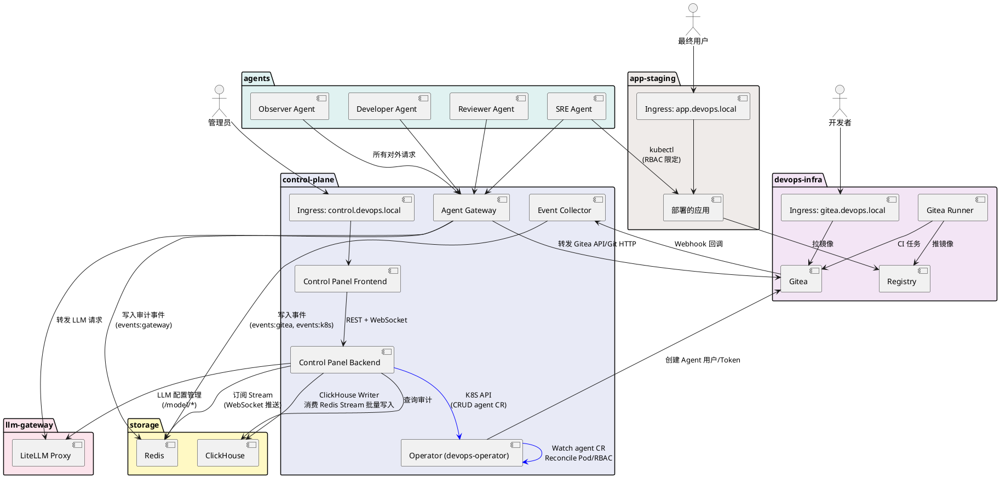
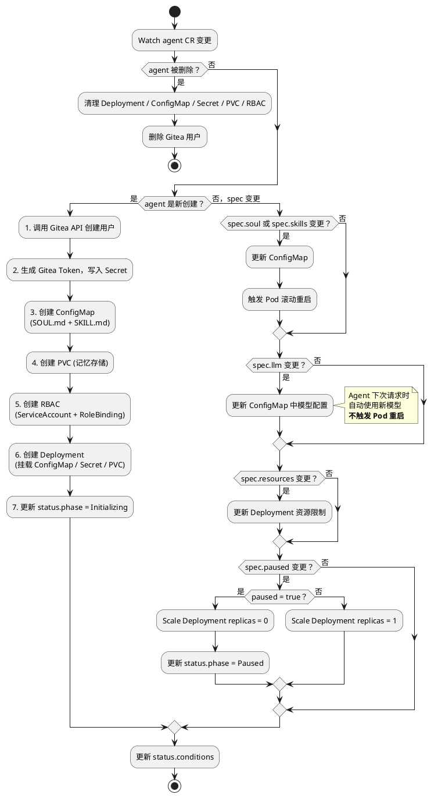

# AI DevOps 模拟平台 - 完整架构设计 V5

## 一、平台概述

AI DevOps 模拟平台是一个在 K8S 集群中运行多个 AI Agent，让它们像人类开发团队一样协作完成软件开发全流程的实验平台。

### 核心理念

- 多角色 AI 团队：Observer（巡检）、Developer（编码）、Reviewer（审查）、SRE（运维）各司其职
- 原生 Git 工作流：Agent 通过 Gitea 的 Issue/PR/CI 协作，与人类开发模式一致
- 统一管控面：通过 K8S CRD + Operator 管理 Agent 生命周期，LiteLLM 管理模型配置
- 全量审计：Agent 所有对外请求经 Gateway 代理，事件流入 Redis Stream -> ClickHouse
- 安全隔离：Agent 不直连任何外部服务，所有请求必须经过 Agent Gateway

### V5 简化决策

| 决策 | 变更 | 原因 |
| --- | --- | --- |
| 去掉 Scenario Controller | 删除 DevScenario CRD 及其 Controller | Agent 自主通过 Gitea Issue Board 领取任务，无需中心化场景编排 |
| 去掉 LLMProfile CRD | LLM 配置不再走 K8S CRD | Frontend -> Backend -> LiteLLM REST API 更直接、更易调试 |
| 仅保留 Agent CRD | Operator 只 Reconcile agent CR | 减少 CRD 数量，降低 Operator 复杂度 |
| Gitea Issue 作为任务看板 | 取代 DevScenario 的任务分发 | 利用 Gitea 原生能力，Agent 行为可在 Gitea UI 中直接观测 |

## 二、整体架构图



## 三、用户访问入口

平台有四类用户角色，分别通过不同的 Ingress 域名访问：

| 用户角色 | 入口域名 | 访问目标 | 认证方式 |
| --- | --- | --- | --- |
| 管理员（人类） | control.devops.local | Control Panel 前端 -> Go Backend | JWT 登录 |
| 开发者（人类） | gitea.devops.local | Gitea Web UI | Gitea 内置认证 |
| AI Agent（程序） | gateway.devops.local（集群内 Service） | Agent Gateway | Bearer Token（Operator 自动签发） |
| 最终用户（可选） | app.devops.local | app-staging 中部署的应用 | 应用自定义 |

### 访问路径说明

- 管理员通过 Control Panel 管理 Agent 配置（agent CRD）、LLM 模型配置（经 Backend 调 LiteLLM API）、查看监控仪表盘、审计日志、导出训练数据。Backend 通过 K8S API 操作 agent CR，通过 LiteLLM REST API 管理模型，通过 ClickHouse 查询审计数据，通过 WebSocket 推送实时事件。
- 开发者（可选）可直接登录 Gitea 查看代码仓库、Issue、PR 等，观察 Agent 的行为产出。也可通过 Gitea 手动创建 Issue 触发 Agent 响应。
- AI Agent 的所有对外请求（LLM 推理、Gitea API、Git HTTP clone/push）均必须经过 Agent Gateway。Gateway 根据 Bearer Token 识别 Agent 身份，记录审计日志到 Event Bus，再转发到实际后端。Agent 不允许直接访问 Gitea 或 LiteLLM。
- 最终用户访问 Agent 部署到 app-staging 中的应用，用于验证 Agent 的部署能力。

## 四、组件职责矩阵

以下矩阵明确每个核心组件该做什么（✅）和不该做什么（❌），避免职责越界。

| 组件 | ✅ 该做 | ❌ 不该做 |
| --- | --- | --- |
| Agent Gateway | 反向代理 Agent 所有请求（LLM/Gitea API/Git HTTP）；识别 Agent 身份（Token -> agent_id）；将请求元数据异步写入 Redis Stream Event Bus；转发请求到实际后端 | 不做业务逻辑判断；不直接写 ClickHouse（通过 Event Bus 异步）；不修改请求/响应内容；不做限流（限流在 LiteLLM 层） |
| Event Collector | 接收 Gitea Webhook 回调；Watch K8S Events（Pod 状态变化、CI Job 完成等）；格式化事件写入 Redis Stream Event Bus | 不做事件响应/触发逻辑；不直接通知 Agent；不直接写 ClickHouse（统一由 ClickHouse Writer 写入）；不做 Webhook 重试（依赖 Gitea 自身重试） |
| Operator | Watch agent CR；Reconcile 为底层 K8S 资源（Deployment、ConfigMap、Secret、PVC、RBAC）；调用 Gitea API 创建用户/Token | 不处理 Webhook；不做场景调度；不管理 LLM 配置（V5 已移交 Backend -> LiteLLM）；**不直接操作 ClickHouse**（心跳检测由 Backend 负责） |
| Control Panel Backend | CRUD agent CRD（通过 K8S API）；查询 ClickHouse 审计数据；JWT 认证；WebSocket 推送实时事件（订阅 Redis Stream）；代理 LLM 配置管理（转发到 LiteLLM REST API）；内嵌 ClickHouse Writer（消费 Redis Stream 批量写入 CH）；**定时心跳检测**（查询 ClickHouse 并通过 K8S API 更新 Agent CR status） | 不直接管理 Pod/Deployment；不做 Reconcile 逻辑；不接收 Webhook |
| Control Panel Frontend | 可视化管理 Agent 和 LLM 模型配置；实时监控仪表盘；审计日志查询/导出 | 不直接调 K8S API；不直接连 ClickHouse |
| LiteLLM Proxy | 统一 LLM 入口；模型路由/负载均衡；Rate Limiting（RPM/TPM）；API Key 管理；缓存（Redis） | 不记审计日志（Gateway 负责）；不做身份识别 |
| Redis (Event Bus) | 作为 Redis Stream 提供事件总线；LiteLLM 缓存；可选：临时状态缓存 | 不做持久化存储（审计数据走 ClickHouse）；不做消息队列的可靠投递保证（ClickHouse Writer 补偿） |
| ClickHouse | 存储全量审计日志（audit.traces）；物化视图自动聚合（token_usage_daily、agent_operations_hourly）；高性能分析查询 | 不做 OLTP；不做实时订阅（用 Redis Stream） |
| Gitea | Git 仓库托管；Issue/PR/Code Review；Webhook 通知；Actions CI/CD | 不做 Agent 管理；不做审计（Gateway 负责） |

## 五、CRD 定义：Agent

V5 只保留 Agent CRD 一种自定义资源，由 Operator 负责 Reconcile。

```yaml
apiVersion: apiextensions.k8s.io/v1
kind: CustomResourceDefinition
metadata:
  name: agents.aidevops.io
spec:
  group: aidevops.io
  versions:
    - name: v1alpha1
      served: true
      storage: true
      schema:
        openAPIV3Schema:
          type: object
          properties:
            spec:
              type: object
              required: [role, soul]
              properties:
                role:
                  type: string
                  enum: [observer, developer, reviewer, sre, custom]
                displayName:
                  type: string
                soul:
                  type: string
                  description: "SOUL.md 内容，定义 Agent 人格"
                skills:
                  type: array
                  items:
                    type: string
                  description: "SKILL 名称列表"
                skillContents:
                  type: object
                  additionalProperties:
                    type: string
                  description: "自定义 SKILL.md 内容 map"
                cron:
                  type: object
                  properties:
                    schedule:
                      type: string
                      description: "Cron 表达式"
                    prompt:
                      type: string
                      description: "定时注入的 prompt"
                llm:
                  type: object
                  properties:
                    model:
                      type: string
                      description: "模型名称，由 LiteLLM 路由"
                    temperature:
                      type: number
                    maxTokens:
                      type: integer
                gitea:
                  type: object
                  properties:
                    username:
                      type: string
                    email:
                      type: string
                    permissions:
                      type: array
                      items:
                        type: string
                      description: "read/write/admin/review/merge"
                kubernetes:
                  type: object
                  properties:
                    namespaceAccess:
                      type: array
                      items:
                        type: string
                      description: "SRE 可操作的 namespace 列表"
                    rbacRole:
                      type: string
                resources:
                  type: object
                  properties:
                    requests:
                      type: object
                      properties:
                        cpu: { type: string }
                        memory: { type: string }
                    limits:
                      type: object
                      properties:
                        cpu: { type: string }
                        memory: { type: string }
                memory:
                  type: object
                  properties:
                    storageSize:
                      type: string
                      default: "1Gi"
                    storageClass:
                      type: string
                paused:
                  type: boolean
                  default: false
                  description: "暂停 Agent 运行"
            status:
              type: object
              properties:
                phase:
                  type: string
                  enum: [Pending, Initializing, Running, Paused, Error]
                conditions:
                  type: array
                  items:
                    type: object
                    properties:
                      type: { type: string }
                      status: { type: string }
                      reason: { type: string }
                      message: { type: string }
                      lastTransitionTime: { type: string, format: date-time }
                giteaUser:
                  type: object
                  properties:
                    created: { type: boolean }
                    username: { type: string }
                    tokenSecretRef: { type: string }
                lastAction:
                  type: object
                  properties:
                    description: { type: string }
                    timestamp: { type: string, format: date-time }
                tokenUsage:
                  type: object
                  properties:
                    today: { type: integer }
                    total: { type: integer }
                podName: { type: string }
                startedAt: { type: string, format: date-time }
      subresources:
        status: {}
      additionalPrinterColumns:
        - name: Role
          type: string
          jsonPath: .spec.role
        - name: Phase
          type: string
          jsonPath: .status.phase
        - name: Model
          type: string
          jsonPath: .spec.llm.model
        - name: Last Action
          type: string
          jsonPath: .status.lastAction.description
        - name: Tokens Today
          type: integer
          jsonPath: .status.tokenUsage.today
        - name: Age
          type: date
          jsonPath: .metadata.creationTimestamp
  scope: Namespaced
  names:
    plural: agents
    singular: agent
    kind: Agent
    shortNames: [da]
```

### kubectl 效果

```bash
$ kubectl get agent -n agents
NAME          ROLE        PHASE    MODEL    LAST ACTION                      TOKENS TODAY   AGE
observer-1    observer    Running  gpt-4o   Created Issue #15: Refactor DB   12340          2d
developer-1   developer   Running  gpt-4o   Pushed to feat/login             45230          2d
developer-2   developer   Running  gpt-4o   Fixed CI failure on PR #8        38100          2d
reviewer-1    reviewer    Running  gpt-4o   Approved PR #7                   8920           2d
sre-1         sre         Running  gpt-4o   Deployed v1.3.2 to staging       5410           2d
```

## 六、Operator Reconcile 逻辑

Operator 仅 Watch agent CR，Reconcile 为底层 K8S 资源。

### 6.1 Reconcile 流程



### 6.2 Agent Pod 组成

每个 Agent 以单 Pod 运行，结构如下：

```text
Agent Pod
├── Init Container: agent-init
│   ├── 从 ConfigMap 挂载 SOUL.md / SKILL.md 到 /agent/config/
│   └── 从 Secret 挂载 Gitea Token 到 /agent/secrets/
├── Main Container: agent-runtime (基于 OpenClaw 镜像)
│   ├── 挂载 PVC 到 /agent/memory/ (记忆持久化)
│   ├── 环境变量:
│   │   ├── AGENT_ID, AGENT_ROLE
│   │   ├── GATEWAY_URL=http://agent-gateway.control-plane.svc
│   │   ├── GITEA_TOKEN_PATH=/agent/secrets/token
│   │   └── LLM_MODEL (来自 spec.llm.model)
│   ├── Liveness: GET /healthz (每 30s, 3 次失败重启)
│   └── Readiness: GET /readyz (每 15s, 2 次失败摘除)
└── Volumes:
    ├── config-volume (ConfigMap)
    ├── secret-volume (Secret)
    └── memory-volume (PVC)
```

## 七、LLM 配置管理

由 Control Panel 直接调用 LiteLLM REST API。

```text
┌──────────────┐    REST     ┌──────────────┐   LiteLLM REST API   ┌──────────────┐
│  Frontend    │ ──────────→ │  Backend     │ ──────────────────→  │  LiteLLM     │
│  (Semi UI)   │   /api/llm  │  (Go)        │   /model/new         │  Proxy       │
│              │ ←────────── │              │   /model/delete      │              │
│              │    JSON     │              │   /model/info        │              │
│              │             │              │   /model/update      │              │
└──────────────┘             └──────────────┘                      └──────────────┘
```

### Backend LLM 管理 API

Backend 对前端暴露以下 REST 端点，内部转发到 LiteLLM：

| Backend API | 方法 | 对应 LiteLLM API | 说明 |
| --- | --- | --- | --- |
| /api/llm/models | GET | GET /model/info | 列出所有已配置模型 |
| /api/llm/models | POST | POST /model/new | 新增模型配置 |
| /api/llm/models/{id} | PUT | POST /model/update | 更新模型配置（如 RPM/TPM 限制） |
| /api/llm/models/{id} | DELETE | POST /model/delete | 删除模型配置 |
| /api/llm/health | GET | GET /health | LiteLLM 健康检查 |

### 模型配置示例

```json
{
  "model_name": "gpt-4o",
  "litellm_params": {
    "model": "openai/gpt-4o",
    "api_key": "sk-xxx",
    "api_base": "https://api.openai.com/v1",
    "rpm": 60,
    "tpm": 100000
  },
  "model_info": {
    "description": "主力模型，用于 Developer/Reviewer"
  }
}
```

Backend 收到后，直接调用 `POST /model/new` 转发给 LiteLLM，不再经过 Operator/CRD。

## 八、Agent 任务分发机制

### 核心思路

Agent 天然以 Gitea Issue 作为工作看板（Board），这与人类开源社区的工作模式完全一致：

```text
┌───────────────────────────────────────────────────────────────┐
│                    Gitea Issue Board                          │
│                                                               │
│  ┌─────────┐   ┌─────────┐   ┌─────────┐   ┌─────────┐        │
│  │  Open   │   │  Doing  │   │ Review  │   │  Done   │        │
│  │         │   │         │   │         │   │         │        │
│  │ Issue#1 │   │ Issue#3 │   │ PR #5   │   │ Issue#2 │        │
│  │ Issue#4 │   │         │   │         │   │ PR #3   │        │
│  │ Issue#6 │   │         │   │         │   │         │        │
│  └─────────┘   └─────────┘   └─────────┘   └─────────┘        │
└───────────────────────────────────────────────────────────────┘
      ↑                ↑              ↑
  Observer Cron    Developer       Reviewer
  管理员手动创建    自行领取         自动触发
```

### 任务创建方式

| 创建者 | 方式 | 示例 |
| --- | --- | --- |
| Observer Agent | Cron 定时巡检仓库，发现问题后自动创建 Issue | 每 30 分钟检查代码质量、测试覆盖率、依赖更新 |
| 管理员（人类） | 通过 Gitea Web UI 或 Control Panel 手动创建 Issue | 新增功能需求、修复已知 Bug |
| Developer Agent | 开发过程中发现子任务，创建关联 Issue | 拆分大任务为小任务 |
| SRE Agent | 巡检部署状态，发现异常创建 Issue | 发现 Pod OOM 创建排查 Issue |

### Agent 任务感知与协作

Agent 之间不直接通信，而是通过 Gitea 原生机制 + Cron 轮询实现松耦合协作：

1. 任务产生
   - Observer Cron 巡检 -> 创建 Issue（标签: priority/high, type/bug）
   - 管理员手动 -> 创建 Issue（标签: type/feature）
2. 任务领取（Developer Agent）
   - Cron 轮询（每 1-5 分钟）-> 查询 Open Issue（按 label 过滤自身角色）
   - 选择优先级最高且未被 assign 的 Issue
   - 自我 assign + 评论 "I'm working on this"
3. 任务执行
   - Developer -> 创建 branch -> 编码 -> 提交 PR -> 关联 Issue（Fixes #N）
   - CI 自动运行 -> Gitea Actions
4. 任务审查（Reviewer Agent）
   - Cron 轮询 -> 查询状态为 Open 的 PR
   - 自动 Review -> Approve / Request Changes
5. 任务完成
   - PR merged -> Issue 自动关闭（Gitea "Fixes #N" 语法）
   - SRE Agent 按需部署到 app-staging

设计选择说明：Agent 通过 Cron 轮询而非事件推送来感知新任务。虽然实时性略差（1-5 分钟延迟），但架构更简单。Agent 不需要维护长连接或事件订阅机制，与 V5 "去中心化" 的设计理念一致。

## 九、Event Bus 事件流设计

### 事件总线选型

使用 Redis Stream 作为统一事件总线，原因：

- 轻量级，无需额外部署 Kafka/RabbitMQ
- 支持 Consumer Group，多消费者并行处理
- 支持 ACK 机制，确保至少一次消费
- 已有 Redis 实例（LiteLLM 缓存），复用即可

### Stream 定义

| Stream 名称 | 生产者 | 消费者 | 事件内容 |
| --- | --- | --- | --- |
| events:gateway | Agent Gateway | ClickHouse Writer, Backend (WebSocket) | Agent 请求审计：agent_id, request_type, method, path, status_code, model, tokens, latency_ms, trace_id |
| events:gitea | Event Collector | ClickHouse Writer, Backend (WebSocket) | Gitea 事件：push, issue_open, issue_comment, pr_open, pr_review, pr_merge, ci_status |
| events:k8s | Event Collector | ClickHouse Writer, Backend (WebSocket) | K8S 事件：pod_started, pod_failed, pod_restarted, deployment_updated, ci_job_complete |

### 数据流路径

```text
                                 ┌─────────────────┐
Agent Gateway ──→ events:gateway ─┤                 │
                                 │  Consumer Group  │
Event Collector ──→ events:gitea ─┤                 ├──→ ClickHouse Writer ──→ ClickHouse
                                 │  group:ch-writer │
Event Collector ──→ events:k8s ──┤                 │
                                 └─────────────────┘
                                 ┌─────────────────┐
                                 │  Consumer Group │
              所有 events:* ──────┤ group:ws-push  ├──→ Backend ──→ WebSocket ──→ Frontend
                                 └─────────────────┘
```

关键约束：所有 ClickHouse 写入统一由 ClickHouse Writer 完成（初期内嵌在 Backend 中）。Gateway 和 Event Collector 不直接写 ClickHouse，确保数据流单向：生产者 -> Redis Stream -> ClickHouse Writer -> ClickHouse。

### 事件数据格式（JSON）

```json
{
  "event_id": "uuid-v4",
  "event_type": "gateway.llm_inference",
  "timestamp": "2026-03-11T13:00:00.000Z",
  "agent_id": "agent-developer-1",
  "agent_role": "developer",
  "payload": {
    "trace_id": "uuid",
    "method": "POST",
    "path": "/v1/chat/completions",
    "status_code": 200,
    "model": "gpt-4o",
    "tokens_in": 1200,
    "tokens_out": 350,
    "latency_ms": 2100
  }
}
```

## 十、Agent 健康检查与异常恢复

### 健康检查设计

| 检查类型 | 实现方式 | 检查频率 | 失败阈值 |
| --- | --- | --- | --- |
| Liveness Probe | HTTP GET /healthz（Agent Runtime 内置健康端点） | 每 30s | 3 次失败 -> 重启 Pod |
| Readiness Probe | HTTP GET /readyz（检查 LLM 连通性 + 记忆加载状态） | 每 15s | 2 次失败 -> 从 Service 摘除 |
| Heartbeat（业务级） | Agent 每 5 分钟通过 Gateway 发 heartbeat（写入 events:gateway Stream） | 每 5min | 15min 无心跳 -> Operator 标记 Error |

Heartbeat 检测机制：Agent heartbeat 经 Gateway 写入 events:gateway Stream -> ClickHouse Writer 写入 audit.traces。**Backend** 定时（每 5 分钟）查询 ClickHouse 检查每个 Agent 的最后心跳时间，超过 15 分钟无心跳则通过 K8S API 更新 Agent CR 的 `status.phase=Error`（Operator 不直接查询 ClickHouse，由 Backend 统一负责数据层访问）。

### Operator 异常恢复流程

```text
1. Operator Watch Pod Events
   │
   ├─ Pod CrashLoopBackOff ──→ 检查 restartCount
   │   ├─ < 5 次 ──→ 等待 K8S 自动重启，更新 status.conditions
   │   └─ >= 5 次 ──→ 标记 phase=Error，发送告警事件到 Event Bus
   │
   ├─ Pod OOMKilled ──→ 自动增加 memory limit（上限 2x 原值），重建 Pod
   │
   ├─ Heartbeat 超时（15min）
   │   ├─ 检查 Pod 是否 Running ──→ Running 但无心跳 → 删除 Pod 触发重建
   │   └─ Pod 不存在 → Reconcile 自动重建
   │
   └─ LLM 连接失败（readyz 检查）
       └─ 不重启 Pod，等待 LiteLLM 恢复（readyz 失败只影响新请求路由）
```

### 告警事件

Operator 在以下情况向 Event Bus 发送告警事件（写入 events:k8s Stream）：

| 告警类型 | 触发条件 | 建议响应 |
| --- | --- | --- |
| agent.crash_loop | restartCount >= 5 | 检查 SOUL.md/SKILL.md 配置是否有误 |
| agent.oom_killed | OOMKilled 事件 | 检查 Agent 是否处理过大的代码仓库 |
| agent.heartbeat_timeout | 15min 无心跳 | 检查 LLM 服务是否正常 |
| agent.token_budget_exceeded | 日 Token 消耗超过阈值 | 考虑降级模型或暂停 Agent |

## 十一、ClickHouse 表设计

### 11.1 推理审计表（主表）

```sql
CREATE TABLE audit.traces (
    -- 标识
    trace_id     UUID,
    span_id      UUID,

    -- Agent 信息
    agent_id     String,
    agent_role   LowCardinality(String),

    -- 请求分类
    request_type LowCardinality(String),  -- llm_inference / gitea_api / tool_call / heartbeat

    -- HTTP 信息
    method       LowCardinality(String),
    path         String,
    status_code  UInt16,

    -- 内容（存储为 JSON 字符串，ClickHouse 支持 JSON 函数提取）
    request_body  String,
    response_body String,
    tool_calls    String,   -- JSON array

    -- LLM 特有
    model         LowCardinality(String),
    tokens_in     UInt32 DEFAULT 0,
    tokens_out    UInt32 DEFAULT 0,
    latency_ms    UInt32,

    -- 时间
    created_at    DateTime64(3) DEFAULT now64(3)
)
ENGINE = MergeTree()
PARTITION BY toYYYYMM(created_at)
ORDER BY (agent_id, request_type, created_at)
TTL created_at + INTERVAL 90 DAY
SETTINGS index_granularity = 8192;
```

### 11.2 Token 消耗汇总表（物化视图自动聚合）

```sql
CREATE MATERIALIZED VIEW audit.token_usage_daily
ENGINE = SummingMergeTree()
PARTITION BY toYYYYMM(day)
ORDER BY (day, agent_id, model)
AS SELECT
    toDate(created_at) AS day,
    agent_id,
    agent_role,
    model,
    sum(tokens_in) AS total_tokens_in,
    sum(tokens_out) AS total_tokens_out,
    count() AS request_count,
    avg(latency_ms) AS avg_latency_ms
FROM audit.traces
WHERE request_type = 'llm_inference'
GROUP BY day, agent_id, agent_role, model;
```

### 11.3 Agent 操作汇总表

```sql
CREATE MATERIALIZED VIEW audit.agent_operations_hourly
ENGINE = SummingMergeTree()
PARTITION BY toYYYYMM(hour)
ORDER BY (hour, agent_id, operation_type)
AS SELECT
    toStartOfHour(created_at) AS hour,
    agent_id,
    agent_role,
    request_type AS operation_type,
    path,
    count() AS operation_count
FROM audit.traces
WHERE request_type = 'gitea_api'
GROUP BY hour, agent_id, agent_role, operation_type, path;
```

### 11.4 典型查询

```sql
-- 某 Agent 最近 50 条推理记录（前端审计页用）
SELECT trace_id, model, tokens_in, tokens_out, latency_ms,
       substring(request_body, 1, 200) AS prompt_preview,
       created_at
FROM audit.traces
WHERE agent_id = 'agent-dev-1' AND request_type = 'llm_inference'
ORDER BY created_at DESC
LIMIT 50;

-- 每日 Token 消耗趋势（前端监控图表用）
SELECT day, agent_id, total_tokens_in + total_tokens_out AS total_tokens
FROM audit.token_usage_daily
WHERE day >= today() - 7
ORDER BY day, agent_id;

-- 导出训练数据（JSONL 格式）
SELECT concat(
    '{"messages":', JSONExtractRaw(request_body, 'messages'),
    ',"response":', JSONExtractRaw(response_body, 'choices'),
    ',"tools":', tool_calls, '}')
AS jsonl_line
FROM audit.traces
WHERE request_type = 'llm_inference'
AND created_at >= '2026-03-01'
FORMAT JSONEachRow;

-- Agent 活跃度排行
SELECT agent_id, agent_role,
       countIf(request_type = 'llm_inference') AS llm_calls,
       countIf(request_type = 'gitea_api') AS gitea_calls,
       sum(tokens_in + tokens_out) AS total_tokens
FROM audit.traces
WHERE created_at >= today()
GROUP BY agent_id, agent_role
ORDER BY total_tokens DESC;

-- Heartbeat 超时检测（Operator 定时执行）
SELECT agent_id, max(created_at) AS last_heartbeat
FROM audit.traces
WHERE request_type = 'heartbeat'
  AND created_at >= now() - INTERVAL 1 HOUR
GROUP BY agent_id
HAVING last_heartbeat < now() - INTERVAL 15 MINUTE;
```

## 十二、K8S 资源分布

| Namespace | 部署的组件 | 说明 |
| --- | --- | --- |
| control-plane | Control Panel Frontend, Backend, Agent Gateway, Event Collector, Operator | 管控面所有组件 |
| storage | Redis, ClickHouse | 数据存储层 |
| devops-infra | Gitea, Gitea Runner, Registry | DevOps 基础设施 |
| llm-gateway | LiteLLM Proxy | LLM 统一入口 |
| agents | Observer, Developer, Reviewer, SRE Agent Pods | AI Agent 运行空间 |
| app-staging | Agent 部署的应用 | 验证 Agent 部署能力的目标环境 |

## 十三、网络策略

以下为组件间全部合法通信路径，未列出的路径默认通过 NetworkPolicy 禁止。

| 源 | 目标 | 协议 | 说明 |
| --- | --- | --- | --- |
| Frontend | Backend | HTTPS | REST + WebSocket |
| Backend | K8S API | HTTPS 6443 | 操作 agent CRD |
| Backend | ClickHouse | TCP 9000 | 查询审计 + ClickHouse Writer 批量写入 + **定时心跳检测** |
| Backend | Redis (Event Bus) | TCP 6379 | 订阅 Stream（WebSocket 推送 + ClickHouse Writer 消费） |
| Backend | LiteLLM | HTTP 4000 | LLM 配置管理（/model/*） |
| Operator | K8S API | HTTPS 6443 | Watch/管理资源 |
| Operator | Gitea API | HTTP 3000 | 创建 Agent 用户/Token |
| Agent Gateway | LiteLLM | HTTP 4000 | 转发 LLM 推理请求 |
| Agent Gateway | Gitea | HTTP 3000 | 转发 Gitea API + Git HTTP 请求 |
| Agent Gateway | Redis (Event Bus) | TCP 6379 | 异步写入审计事件（events:gateway） |
| Agents | Agent Gateway | HTTP | 所有对外请求（LLM/Gitea API/Git HTTP） |
| Agent SRE | K8S API (app-staging) | HTTPS 6443 | kubectl（RBAC 限定 app-staging namespace） |
| Event Collector | Redis (Event Bus) | TCP 6379 | 写入事件（events:gitea, events:k8s） |
| Gitea | Event Collector | HTTP (Webhook) | Gitea Webhook 回调 |
| Gitea Runner | Gitea | HTTP 3000 | CI 任务 |
| Gitea Runner | Registry | HTTP 5000 | 推镜像 |
| app-staging | Registry | HTTP 5000 | 拉镜像 |
| LiteLLM | Redis | TCP 6379 | 推理缓存 |
| 外部用户 | Ingress (control.devops.local) | HTTPS | 管理面板 |
| 外部用户 | Ingress (gitea.devops.local) | HTTPS | Gitea Web UI |
| 外部用户 | Ingress (app.devops.local) | HTTPS | 部署的应用 |

